Analytics assignment

**1.Data collection:**

My target feature is “work\_performance\_label”, the one our model will try to predict based on the features in our dataset by trying to find a pattern. The model’s job is to predict highly performative employees.

Explaining each column:

Work\_performance\_metric1 which a numerical continuous feature which shows their work performance out of a 100.

Sleep\_related\_metric  is a numerical continuous feature which shows how many hours they sleep .

activity\_metric is a numerical continuous feature which shows how much they exercise.

screen\_related\_metric is a numerical continuous feature which shows their screen time usage.

time\_metric is a numerical continuous feature which shows their time related metric in relation to work.

Level\_Group is a categorical feature which shows if they are in High, medium or  Low level group.

Category\_Type is a categorical feature which shows what type they are like TypeA, Type B or TypeC.

work\_performance\_label is the target feature which shows if they are a 1 or 0 for high or low performer.

**2.Data exploration:**

Numerical features, I used these formulas

**For work\_performance\_metric1:**\
Mean: =AVERAGE(A2:A144)\
Median: =MEDIAN(A2:A144)\
Standard Deviation: =STDEV.S(A2:A144)\
Correlation with Target: =CORREL(A2:A144,H2:H144)

**For sleep\_related\_metric:**\
Mean: =AVERAGE(B2:B144)\
Median: =MEDIAN(B2:B144)\
Standard Deviation: =STDEV.S(B2:B144)\
Correlation with Target: =CORREL(B2:B144,H2:H144)

**For activity\_metric:**\
Mean: =AVERAGE(C2:C144)\
Median: =MEDIAN(C2:C144)\
Standard Deviation: =STDEV.S(C2:C144)\
Correlation with Target: =CORREL(C2:C144,H2:H144)

**For screen\_related\_metric:**\
Mean: =AVERAGE(D2:D144)\
Median: =MEDIAN(D2:D144)\
Standard Deviation: =STDEV.S(D2:D144)\
Correlation with Target: =CORREL(D2:D144,H2:H144)

**For time\_metric:**\
Mean: =AVERAGE(E2:E144)\
Median: =MEDIAN(E2:E144)\
Standard Deviation: =STDEV.S(E2:E144)\
Correlation with Target: =CORREL(E2:E144,H2:H144)

Below is the result of the data exploration stage, formulas are provided above:

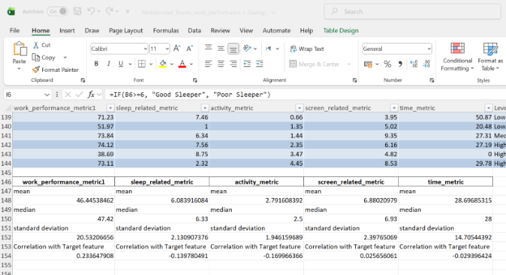

**Categorical features:**

` `**Cetgorical feature 1**: **Level\_Group  feature frequency distribution** 

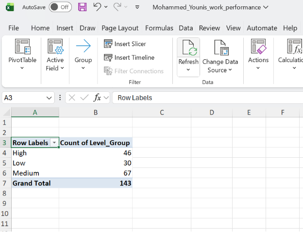

**Level group feature vs Target feature (relationship between them)**

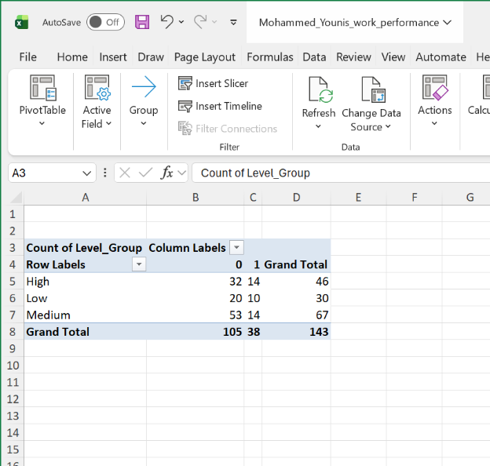

**Categorical feature 2 : Category\_type feature frequency distribution**

Looked at frequency distribution between each of the different Category types

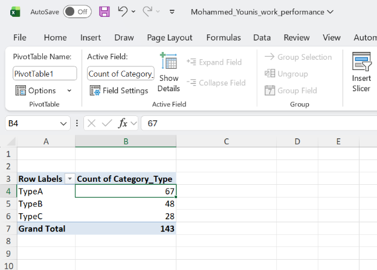

**Category\_type feature vs Target feature (relationship between them)**

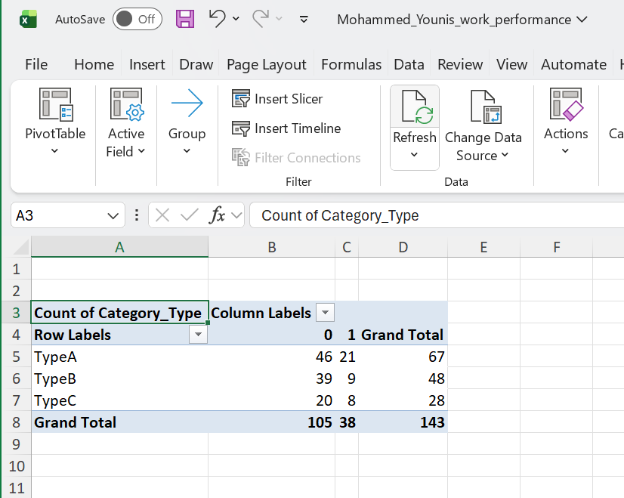

This shows you how each category relates to the target (0 vs 1).

**3. Data cleaning and Pre-processing:**

I cleaned the data using the find and select and then highlighting blanks and deleting the rows that had blank cells.

The reason I did this is because every column had a couple of cells with blank values which means I can’t fill the values or can’t drop columns as that wouldn’t be feasible.

I evaluated column-wise deletion and mean imputation, but the random distribution of missing values across features made my method (deleting rows with blank columns) the most methodologically sound approach.

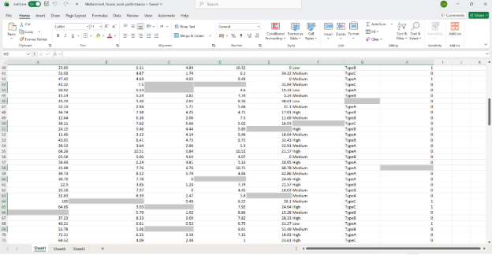

**Feature transformation: good\_sleeper\_category**

Formula: =IF(B2>=6, "Good Sleeper", "Poor Sleeper")

Why: 6+ hours of sleep is the general recommendation for adults. This feature categorizes people based on whether they meet this healthy sleep threshold, which might relate to their work performance. 

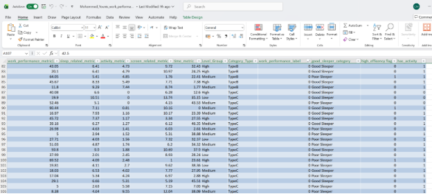

**4.Feature engineering:**

**High\_efficiency\_flag**

I created the high\_efficiency\_flag because I noticed that employees who achieve high work performance scores with low time investment tend to be classified as high performers, while those who take more time for similar results are often classified as lower performers.

This is shown by this pivot table which shows that people who have a high efficiency have a higher probability of being labeled as a high performer (target feature).

` `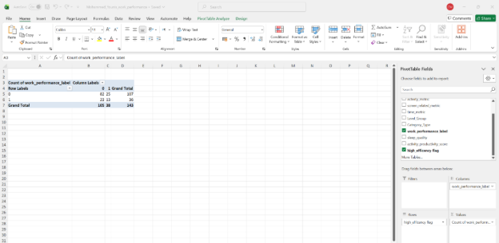

The formula  I used: =IF(AND(A2>50,E2<30),1,0)

I set the formula to find efficient workers because I noticed a clear pattern: employees who deliver high performance (over 50) quickly (under 30 time) are consistently the top performers in the data.

` `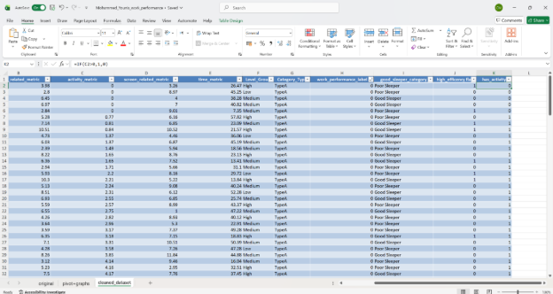

**Feature 2:**

**has\_activity:**

Formula: =IF(C2>0,1,0)

![A screenshot of a computer pic]

**Why:** Because I can see that having any physical activity (even small amounts) strongly correlates with being a high performer in your dataset.

This is seen below (pivot table) where you can see that people who do even a little bit of activity are way more likey to be labeled as a high performer (target feature) . 33 people with activity are labebled as high performers while people (5) with 0 activity are labeled as a high performers:

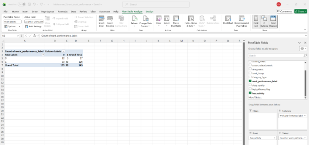

**5. Visualization:**

**Activity vs Performance Analysis**

This chart shows the relationship between physical activity and work performance. It clearly demonstrates that employees with some physical activity (has\_activity = 1) are much more likely to be high performers compared to those with no activity.

The data shows:

Only 5 out of 17 employees with no activity were high performers (29%)

33 out of 126 employees with some activity were high performers (26%)

The chart reveals that the vast majority of high performers (33 out of 38) come from the active group, indicating activity may be a contributing factor to high performance.

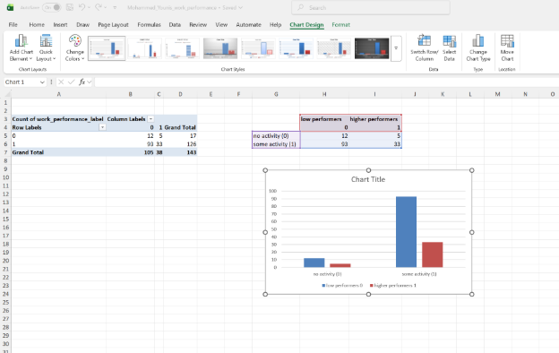

I then visualized the frequency of each category type to understand their distribution

Type A is the most frequent one and represents the majority of employees.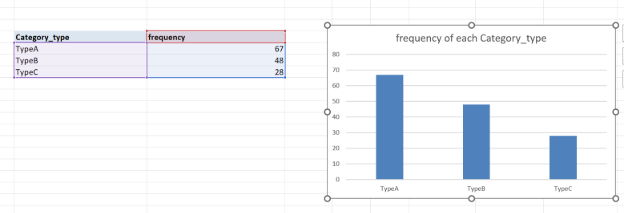

I also visualized the frequency of each Level group for the same reason (understanding distribution) .

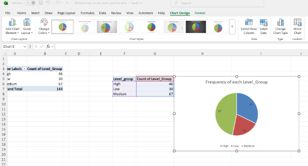

6\. Modelling:

Orange: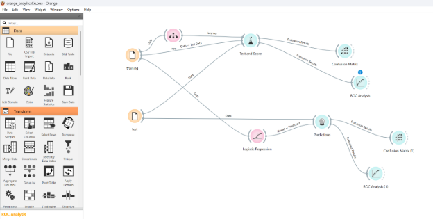

**Model Evaluation: Decision Tree**

` `I trained the Decision Tree model using a 70/30 split, meaning 70% of the data for training and 30% for testing. The test set had 42 employees, 31 low performers and 11 high performers.

Looking at the results, the model got 27 out of 42 predictions right, which is 64% accuracy. However, it struggled to spot high performers, it only found 4 of the 11 actual high performers in the test data. This means it missed 7 people who were actually high performers.

When the model did predict someone was a high performer, it was only right about 33% of the time. The ROC curve shows the model is better than random guessing, but still isn't great at reliably identifying top performers.

The 70/30 split helped a bit compared to my first attempt (I tried 60/40 split first), it found more high performers (36% vs 27% previously) but there's still room for improvement as it's missing too many good employees.

**Confusion Matrix Results:**

- True Positives: 4 (correctly identified high performers)
- False Positives: 8 (low performers wrongly classified as high performers)
- False Negatives: 7 (high performers missed and called low performers)
- True Negatives: 23 (correctly identified low performers)

**Performance Calculations:**

- **Accuracy** = (4 + 23) / 42 = 27/42 = **64%**
  - The model got 64% of all predictions correct
- **Recall** = 4 / (4 + 7) = 4/11 = **36%**
  - Only found 36% of the actual high performers
- **Precision** = 4 / (4 + 8) = 4/12 = **33%**
  - When it predicts a high performer it's only right 33% of the time

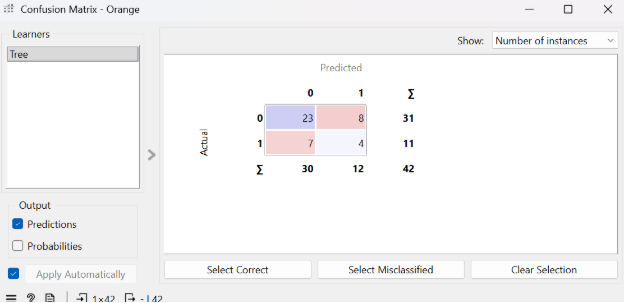![A screenshot of a computer&#x0A;&#x0A;pic]
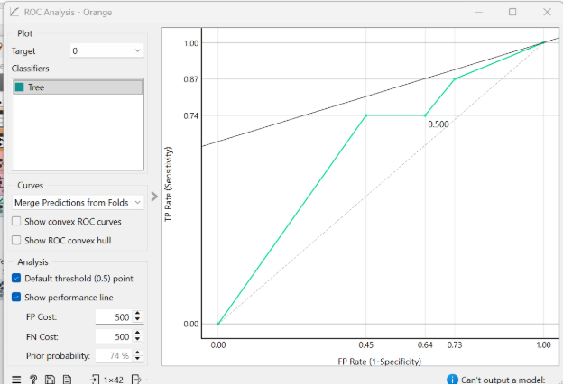

**Model Evaluation: Logistic Regression** 

I tested the Logistic Regression model using the same 70/30 split. The results show some interesting differences from the Decision Tree.

Looking at the confusion matrix, the model got 33 out of 42 predictions right (79% accuracy). It correctly identified 29 of the 31 low performers, which is really good. However, it still struggled with high performers, it found only 4 of the 11 actual high performers, missing 7 of them.

When it predicts someone is a high performer, it's more reliable than the Decision Tree , it's right about 67% of the time (4 out of 6 predictions).

The ROC curve shows this model is actually quite good at sorting people, the curve moves steeply upward, meaning it's much better than random guessing at telling the difference between high and low performers.

While it's more accurate overall (79% vs 64%), it still has the same problem of missing too many high performers. But when it does identify someone as high-performing, you can trust that prediction more.

Confusion Matrix Results:

- True Positives: 4 (correctly identified high performers)
- False Positives: 2 (low performers wrongly classified as high performers)
- False Negatives: 7 (high performers missed and called low performers)
- True Negatives: 29 (correctly identified low performers)

Performance Calculations:

- Accuracy = (4 + 29) / 42 = 33/42 = 79%
  - The model got 79% of all predictions correct
- Recall = 4 / (4 + 7) = 4/11 = 36%
  - Only found 36% of the actual high performers
- Precision = 4 / (4 + 2) = 4/6 = 67%
  - When it predicts a high performer it's right 67% of the time

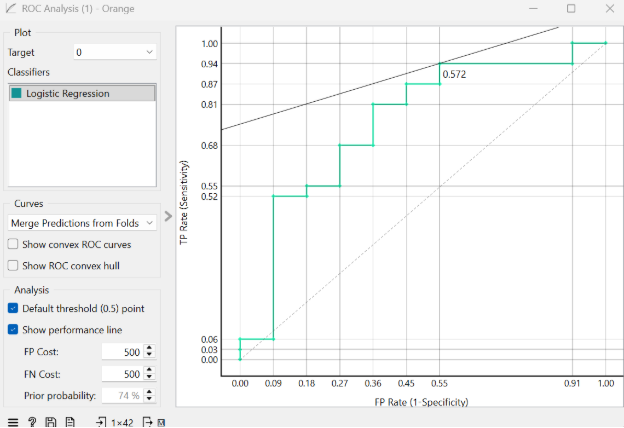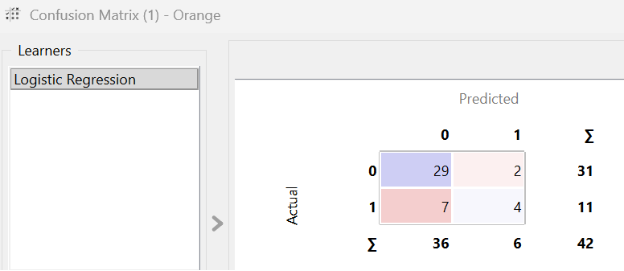

**Which Model Generalizes Better**

The **Logistic Regression model generalizes better** to new, unseen data. I have determined this based on a direct comparison of the evaluation results.

While both models had the same **recall** (36%), meaning they were equally poor at finding all the actual high performers, the Logistic Regression model was superior in two key areas that affect real-world usability:

1. **Overall Accuracy:** It achieved a significantly higher accuracy of **79%** compared to the Decision Tree's 64%. This means it made correct predictions more often across the board.
1. **Precision:** This is the most important differentiator. Logistic Regression had a precision of **67%**, double that of the Decision Tree (33%). This means that when Logistic Regression flags an employee as a “high performer” we can be much more confident that it is correct. The Decision Tree, on the other hand, was wrong about two-thirds of the time it made a positive prediction, which would lead to wasted resources and inaccurate targeting in a business context.

The ROC analysis supports this conclusion, showing that the Logistic Regression model has better overall discriminatory power.

Therefore, for the purpose of reliably identifying high performers, the Logistic Regression model is the stronger and more trustworthy model for generalization, though both aren’t great at correctly identifying a highly performative employee.

**Reflection:**

This assignment provided a really valuable, hands on journey through the entire process of a data analysis project. 

` `I learned the importance of the foundational stages, like data cleaning and feature engineering. Initially, handling missing values by deleting rows was a straightforward decision to ensure data integrity for the model. While I do believe this approach was effective for this project, I would try using other techniques like imputations if I were to do this again, out of curiosity of how the model would improve/worsen if I did that.

The most engaging part was feature engineering. By closely examining the data and making pivot tables to try and find a pattern in the data. I noticed that efficiency (high output in less time) was a key trait of top performers which is why I created the **high\_efficiency** feature in hope of giving the model more hints to better predict the target feature.

Using Orange to build and evaluate the models was insightful. It made abstract concepts like precision and recall very concrete. For instance, seeing that the Logistic Regression model had high overall accuracy but struggled with recall was a crucial lesson. It highlighted that a model's success depends heavily on the project's specific goal, in this case, correctly identifying high performers was our priority.

If I were to do this assignment again I would change some stuff but overall I am happy with with what I did, as this assignment is about the process and learning and not about the model being 100% prefect.

Overall, this project was a rewarding challenge. It deepened my understanding of the analytics pipeline and taught me the importance of clear reasoning and interpretation at every stage, not just the final result.

[A screenshot of a computer

pic]: Aspose.Words.a7054522-0eed-4a1a-b765-8fd0d5c94d1b.009.png
